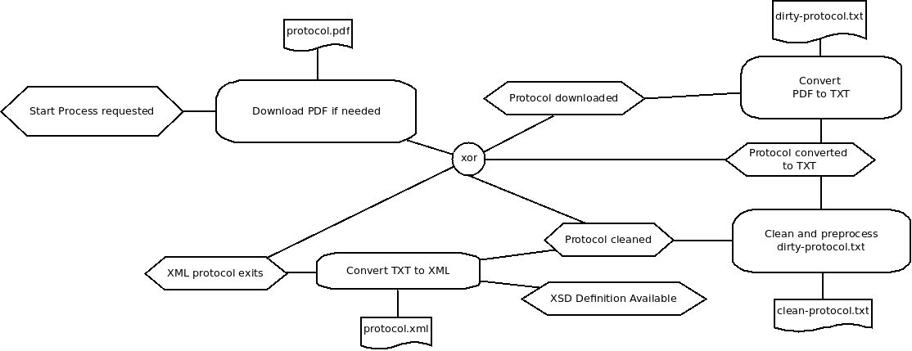

openLegislature
===============

Welcome on our project page. The goal of this project is to gain insights of german politics using computer science. 
We use the `http://dip21.bundestag.de/dip21/btp/{period}/{period}{session}.pdf` page to extract all protocols of the German Bundestag. 
We will analyse those protocols to answer interesting questions regarding the whole history of the Federal Republic of Germany.

## What kind of questions do we ask?

The orignal intention was to find similarities in speeches of politicians from different parties. This could indicate that the speech is maybe written from the same (ghost)writer. The answer of this question is really hard, because there is no information about ghostwriters. 

So we will adjust our questions to be more historically and statistically and maybe we can still answer the former question in the future.
For example it could be really interesting to answer questions like:

- How many speakers spoke to the Bundestag?
- How many speeches are given by some party?
- How many speakers spoke to a specific topic?

We also plan to compare speeches to each other. We can use methods of information retrieval to do so.

## How do we process our corpus?

In the moment, we transfer the unstructured data available as PDF to an structured data format (XML).
Take a look on the following event driven process chain, which describes our current implementation for each available protocol:

As you can see, we start on the top left of the picture, downloading the protocol as PDF. Than it get's converted to TXT, using a java library to do so. 
Afterwards we clean up the text representation for easier processing in a later stage. 
Referring to an XML-schema definition (XSD) we mark all parts of a protocol to be able to identify the structure of every protocol. 
The result is an XML representation of the speech, which is much easier processable by a computer. 

This process chain will be continued. 

Final note: The whole process is implemented in parallel and just performs the steps which are not already done. For example, if a protocol was already downloaded, we don't download that particular protocol again.

## What type of analysis will we do?

Well we consider to use the following IR methods in our project:

- NER (named entity recognition)
- Clustering / Unsupervised machine learning algorithms
- LDA (latent Dirichlet allocation)

In the moment we try to achieve better data quality so this part is not on our agenda yet.
